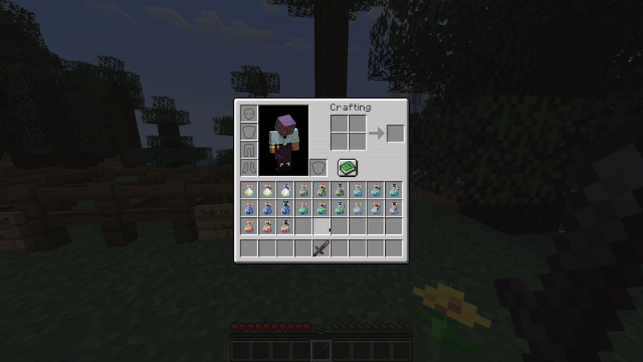

## About
Blade Oil is species-based poison mod inspired by the Witcher game series.  Using various ingredients players are able to create oils which when applied to a weapon, will do additional damage to specific mob types.

Oil recipes can be discovered by collecting various items such as plants and mob drops.

This mod requires [NModUtils](https://github.com/tnoctua/nmodutils) to function!

## How to Use

1. Craft an oil
2. Pick up the oil with your cursor
3. Right-click on the weapon with the oil

### Demonstration

## Configuration
Blade oil properties can be completely configured by editing: `$MC_ROOT/config/bladeoil.json`

### Properties
- **Damage** - how much additional damage an oiled weapon does
- **Quality** - how many hits the effect will last before the weapon will need to be reoiled
- **Amount** - how many uses an oil bottle has before it is completely depleted.

## Default Damage

### Most Oils
- **Basic Oil**: 4 Damage (2 Hearts)
- **Enhanced Oil**: 8 Damage (4 Hearts)
- **Superior Oil**: 12 Damage (6 Hearts)

### Hanged Man's Venom
- **Basic Oil**: 2 Damage (1 Hearts)
- **Enhanced Oil**: 4 Damage (2 Hearts)
- **Superior Oil**: 8 Damage (4 Hearts)

 
  

